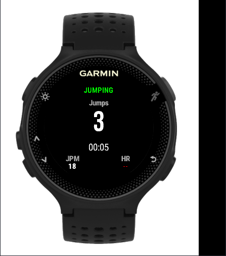
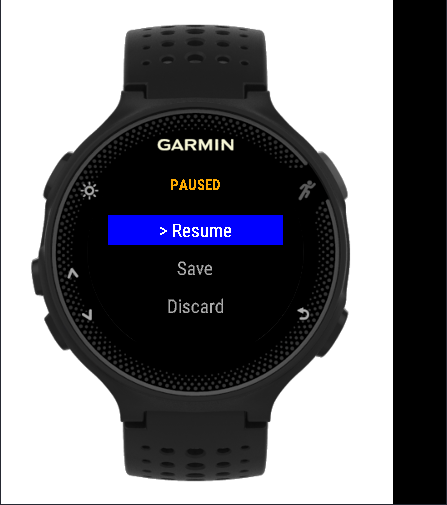
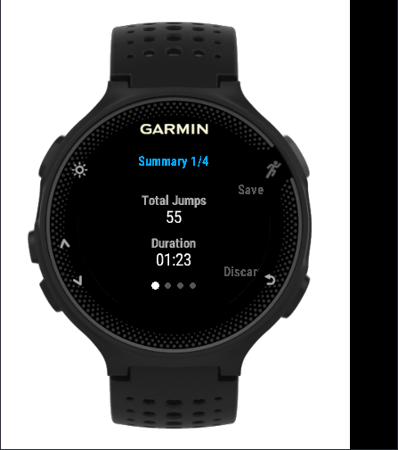

# JumpRope

A jump rope tracking app for the **Garmin Forerunner 235**, built with Connect IQ 1.3 and Monkey C.

Counts jumps in real time using the wrist accelerometer, records workouts as FIT activities (syncs to Garmin Connect), and displays live metrics on the watch face.

## Features

- **Real-time jump counting** — two-threshold accelerometer state machine at 25Hz with rolling average smoothing
- **Live workout display** — jump count, elapsed timer (MM:SS), jumps per minute, heart rate
- **Start / Pause / Resume / Stop** — full workout lifecycle via physical buttons
- **FIT activity recording** — saves to Garmin Connect with 3 custom fields: total jumps, avg JPM, peak JPM
- **Calorie estimation** — MET-based calculation (12.0 METs for moderate jump rope)
- **Milestone vibration alerts** — haptic feedback every N jumps (configurable, default 100)
- **Countdown timer** — optional timed sessions with auto-pause and vibration on expiry
- **Post-workout summary** — total jumps, duration, avg/peak JPM, calories, avg/max heart rate

## Screenshots

| Idle | Jumping | Pause Menu | Summary |
|------|---------|------------|---------|
|  |  |  |  |

## Device Compatibility

| Spec | Value |
|------|-------|
| Target | Garmin Forerunner 235 |
| Platform | Connect IQ 1.3 |
| Screen | 215x180 px, semi-round, color |
| Sensors | Accelerometer, optical HR |

## How It Works

The jump detection algorithm uses a **two-threshold state machine** on the accelerometer Z-axis (vertical):

```
GROUND state:
  smoothed Z > 1800 milliG (1.8G) AND debounce passed → AIR state

AIR state:
  smoothed Z < 500 milliG (0.5G) → GROUND state, jump counted
```

A 5-sample rolling average smooths sensor noise. A 150ms debounce prevents double-counting (caps at ~400 JPM). Thresholds are tunable via app settings.

## Project Structure

```
JumpRope/
├── manifest.xml                    # CIQ 1.3, Sensor + FitContributor permissions
├── monkey.jungle                   # Build configuration
├── source/
│   ├── Constants.mc                # All tunable thresholds, colors, states
│   ├── JumpDetector.mc             # Accelerometer jump detection engine
│   ├── SessionManager.mc           # FIT recording, calories, HR stats
│   ├── MainView.mc                 # Workout screen display + lifecycle
│   ├── MainDelegate.mc             # Button handling state machine
│   ├── PauseMenuView.mc            # Pause menu (Resume/Save/Discard)
│   ├── PauseMenuDelegate.mc        # Pause menu input handling
│   ├── SummaryView.mc              # Post-workout stats display (paginated)
│   ├── SummaryDelegate.mc          # Save/discard session handling
│   └── JumpRopeApp.mc              # App entry point
├── resources/
│   ├── layouts/
│   │   ├── MainLayout.xml          # Workout screen layout
│   │   └── SummaryLayout.xml       # Summary screen layout
│   ├── strings/strings.xml         # String resources
│   └── drawables/
│       ├── drawables.xml           # Drawable definitions
│       └── launcher_icon.png       # App icon (80x80)
└── properties/properties.xml       # User-configurable settings
```

## Settings

All settings are configurable via Garmin Connect Mobile or Garmin Express:

| Setting | Default | Range | Description |
|---------|---------|-------|-------------|
| Jump Threshold | 1800 | 1200–3000 | Takeoff detection sensitivity (milliG) |
| Landing Threshold | 500 | 200–800 | Landing detection sensitivity (milliG) |
| Debounce | 150 | 50–500 | Min ms between jumps |
| Sample Rate | 25 | 10–50 | Accelerometer polling Hz |
| User Weight | 70 | 20–300 | Weight in kg (for calories) |
| Milestone Interval | 100 | 0–1000 | Jumps between vibration alerts (0 = off) |
| Countdown Seconds | 0 | 0–3600 | Countdown duration (0 = count up) |

## Building

### Prerequisites

- Java JDK 8+
- VS Code with [Monkey C extension](https://marketplace.visualstudio.com/items?itemName=garmin.monkey-c)
- [Connect IQ SDK](https://developer.garmin.com/connect-iq/sdk/) (install via SDK Manager)
- Forerunner 235 device support package

### Build & Run

1. Open the project in VS Code
2. Generate a developer key: `Monkey C: Generate Developer Key`
3. Set active device to `forerunner235`
4. Build: `Ctrl+Shift+B` or `Monkey C: Build Current Project`
5. Run in simulator: `F5`

### Side-load to Device

1. Connect FR235 via USB
2. Copy the `.prg` file from `bin/` to `GARMIN/APPS/` on the watch
3. Eject and disconnect — the app appears in the activity list

See [BUILD_AND_TEST.md](BUILD_AND_TEST.md) for the full guide including threshold tuning and store publishing.

## Controls

| Button | Idle | Recording | Pause Menu | Summary |
|--------|------|-----------|------------|---------|
| **START** | Begin workout | Pause → menu | Select option | Save session |
| **UP/DOWN** | — | — | Navigate options | Cycle pages |
| **BACK** | Exit app | — | Resume | Discard session |

## Tuning Jump Detection

The default thresholds work well for standard single jumps with the watch worn snugly. For best accuracy:

1. Start a session and count 100 jumps manually
2. Compare the app's count to your manual count
3. Adjust thresholds in settings if needed:
   - **Missed jumps?** Lower the jump threshold
   - **False counts?** Raise the jump threshold or increase debounce
   - **Double counting?** Raise the landing threshold

Target accuracy: **95%+** for standard single jumps.

## Known Limitations

- Optimized for standard single jumps — double-unders may need different thresholds
- Watch must be worn snugly on the wrist for reliable detection
- Very slow (<40 JPM) or very fast (>300 JPM) jumps may be less accurate
- Calorie estimation assumes continuous activity during recording time (standard MET approach)

## License

MIT
